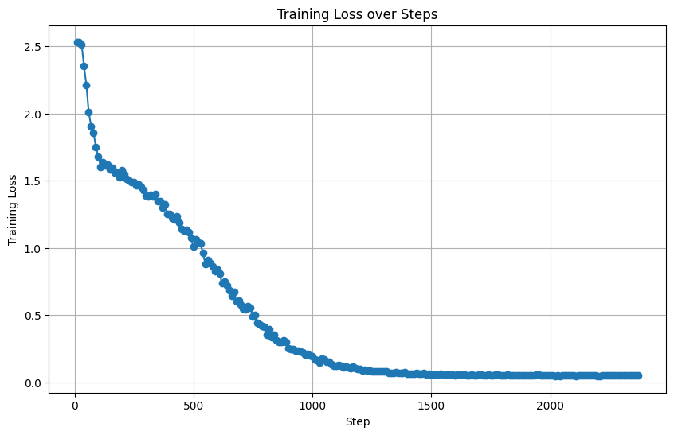

# XÂY DỰNG HỆ THỐNG CHẨN ĐOÁN UNG THƯ DA TÍCH HỢP CHATBOT

### EDA (Exploratory Data Analysis)

### Kiến trúc DermModelWithData

### Kết quả huấn luyện mô hình ViT-9

### Kiểm thử trên tập test

### Voting Ensemble và Stacking Ensemble phân loại lại 3 lớp nhầm lẫn

### Kết quả cho dự đoán riêng 3 lớp

### Xử lí nâng cao khi mô hình không chắc chắn

### Kết quả xử lí nâng cao so với kết quả ban đầu

### Ma trận nhầm lẫn

Sau khi xử lí lần 2:

### Huấn luyện dữ liệu crawl từ Dermnet bằng LLaMA 2-7B với LoRA

### Cài đặt chatbot có kết hợp RAG real-time

### Download all checkpoints:

https://dutudn-my.sharepoint.com/:u:/g/personal/102200266_sv1_dut_udn_vn/EVlXpIMehh5ChZL7FjRJSZgBbt40YZGdSHhAiN3vTaqeHQ?e=Tuugnw

### Kiểm thử chương trình

Login

Chẩn đoán

Chatbot Hybrid

Mạng xã hội chia sẻ nội bộ ứng dụng

